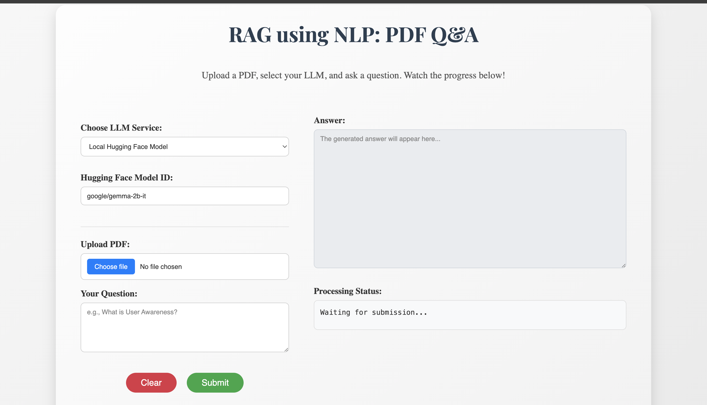

# Local RAG Pipeline using NLP for PDF Q&A

This project implements a **Retrieval-Augmented Generation (RAG)** pipeline using **Natural Language Processing (NLP)** techniques to answer questions based on a user-specified PDF document. It runs locally on a GPU, processing text, generating embeddings, retrieving relevant chunks, and producing answers with a Large Language Model (LLM).

## Features
- **Custom PDF Support**: Users can upload any PDF via a command-line argument or web UI.
- **Local Execution**: Runs on your GPU (e.g., NVIDIA RTX 4090) for privacy and speed.
- **NLP-Driven**: Leverages text extraction, chunking, and embeddings for robust RAG.
- **Modular Design**: Organized into reusable modules for maintainability.

## Technical Architecture

This RAG pipeline follows a standard architecture:

1. **Document Processing**: PDF extraction and chunking
2. **Embedding Generation**: Conversion of text chunks to vector representations
3. **Vector Storage**: Efficient storage and retrieval using FAISS
4. **Retrieval**: Semantic search for relevant context
5. **Generation**: LLM-based answer synthesis from retrieved context

## Chunking Strategy

The system implements optimized document splitting with:
- Default chunk size: 200-300 words (configurable)
- Chunk overlap: 10% to maintain context between chunks
- Semantic chunking: Preserves paragraph and section boundaries

## Supported LLM Options

- **Local Models**: Hugging Face transformers (Llama, Gemma)
- **API Services**: OpenAI, Google Gemini, Groq
- **Configuration**: Adjustable temperature and context parameters

## Vector Storage

The system uses FAISS for vector storage and retrieval, with options to:
- Persist embeddings between sessions
- Update the database with new documents
- Configure similarity thresholds

## Setup
1. **Clone the Repository**:
   ```
   git clone https://github.com/tirth8205/RAG_using_NLP.git
   cd rag-using-nlp
   ```
2. **Install Dependencies**:
   ```
   pip install -r requirements.txt
   python -m spacy download en_core_web_sm
   ```
3. **Run the Pipeline**:
   - Command-line:
     ```
     python rag_pipeline.py --pdf /path/to/your/file.pdf --query "Your question here"
     ```
   - Web UI:
     ```
     python app.py
     ```
     Open the provided URL in your browser, upload a PDF, and ask a question.

## Requirements
- Python 3.11+
- NVIDIA GPU with CUDA support (minimum 8GB VRAM recommended)
- ~10GB disk space (for embeddings and models)

## Project Structure
- `rag_pipeline.py`: Main script for command-line RAG pipeline.
- `pdf_processor.py`: Extracts and chunks PDF text.
- `embedder.py`: Creates and manages embeddings.
- `retriever.py`: Retrieves relevant chunks using Faiss.
- `generator.py`: Generates answers with an LLM.
- `app.py`: Web UI using FastAPI with Server-Sent Events (SSE) for real-time processing updates.

## Technical Implementation
- **Embedding Model**: Uses Sentence Transformers (all-MiniLM-L6-v2) for creating document and query embeddings
- **Retrieval**: Implements semantic search with cosine similarity using FAISS
- **Chunking Strategy**: Text is split into semantic chunks using NLP techniques

## Web Interface

- Built with FastAPI and Server-Sent Events
- Real-time processing updates
- PDF upload and management
- Query history tracking



## Configuration

Environment variables for API keys:
- `OPENAI_API_KEY`: For OpenAI services
- `GOOGLE_API_KEY`: For Google Gemini
- `GROQ_API_KEY`: For Groq services
- `EMBEDDING_MODEL`: To specify custom embedding model

## Common Challenges and Solutions

This implementation addresses several common RAG challenges:

- **Missing Content**: Uses query augmentation to improve retrieval
- **Format Consistency**: Structured output formatting for clear responses
- **Hallucination Reduction**: Citations to source material

## Performance Metrics

The system can be evaluated on:
- **Relevance**: How well retrieved content matches queries
- **Answer Quality**: Accuracy and completeness of generated responses
- **Processing Speed**: End-to-end latency

## Example Output
```
Query: What is User Awareness?
Answer: User Awareness refers to understanding the needs, behaviors, and interactions of users with smart devices and environments in ubiquitous computing.
```

## Troubleshooting

- **Memory Issues**: For large PDFs, adjust chunk size or use a memory-efficient embedding model
- **No Answer Displayed**: Check browser console for JavaScript errors
- **Slow Performance**: Ensure GPU acceleration is properly configured
- **API Key Issues**: Verify credentials for external services

## Skills Demonstrated
- **NLP**: Text extraction, chunking, embeddings.
- **RAG**: Retrieval, augmentation, generation.
- **Machine Learning**: Sentence Transformers, Faiss, LLMs.
- **Software Engineering**: Modular design, error handling.
- **GPU Optimization**: Local execution, batch processing.

## Future Improvements
- Add evaluation metrics for answer quality.
- Scale to multiple PDFs with a vector database.

## Author
- Tirth Kanani
- [LinkedIn](https://www.linkedin.com/in/tirthkanani/)
